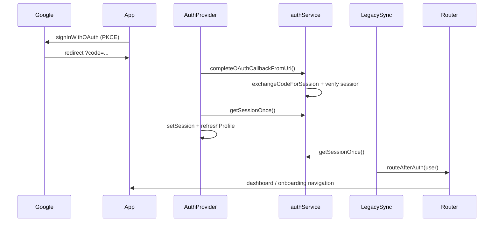

# Project Status — Post Auth Fix

**Date:** 2026-06-21  
**Scope:** Critical auth/session/navigation blockers only

---

## Startup Status

| Item | Status | Notes |
|------|--------|-------|
| Vite + React mount | ✅ Expected OK | Unchanged |
| Legacy script bootstrap (`main.js`) | ✅ Expected OK | Critical fixes install at boot |
| Supabase client global | ✅ **Fixed** | Set in `client.js` at creation |
| Loading overlay crash on early OAuth | ✅ **Fixed** | Null-safe legacy helpers |
| Backend hydration timeout | ✅ OK | 1.5s ceiling unchanged |

---

## Authentication Status

| Item | Status | Notes |
|------|--------|-------|
| Supabase client init | ✅ Working (prior) | Env vars load correctly |
| Google OAuth PKCE start | ✅ Working (prior) | Dynamic `redirectTo` from origin |
| OAuth callback detection | ✅ Working (prior) | Query + hash code parsing |
| PKCE code exchange | ✅ **Improved** | Session validated after exchange |
| Session persistence | ✅ **Fixed** | AuthProvider waits for exchange before `getSessionOnce` |
| AuthProvider `hasSession` | ✅ **Fixed** | Pending auth events applied after init |
| Legacy `syncSessionFromSupabase` | ✅ **Fixed** | Supabase global + shared OAuth completion |
| False-positive exchange success | ✅ **Fixed** | Throws if no session returned |

---

## Routing Status

| Item | Status | Notes |
|------|--------|-------|
| OAuth callback routing entry | ✅ **Fixed** | Retry when first sync fails |
| `routeAfterAuth` invocation | ✅ **Expected OK** | Runs once session user exists |
| Dashboard redirect | ✅ **Expected OK** | Depends on profile/onboarding state |
| Landing override during auth restore | ✅ OK (prior) | Bootstrap lock guards unchanged |

---

## Database Status

| Item | Status | Notes |
|------|--------|-------|
| Anonymous 401 on curriculum tables | ✅ **Expected resolved** | Caused by missing JWT; fixed with session restore |
| RLS policies | ⚠️ Verify in Supabase | Schema doc notes authenticated policies; run `supabase/schema.sql` if not applied |
| Profile fetch/create | ⚠️ Depends on DB | Requires `profiles` table + RLS for authenticated user |
| `app_state` remote hydration | ⚠️ Unchanged | May still 403 if RLS migration not applied (separate from this fix) |

---

## Remaining Issues

1. **Supabase redirect URL allow-list** — Must include the exact Cloud Workstations origin in Supabase dashboard (deployment config, not code).
2. **Dev server host** — `package.json` uses `--host 127.0.0.1`; Cloud Workstations may need `--host 0.0.0.0` for external access (operational, not auth logic).
3. **Build verification** — `npm run build` was not executed in the fix environment (Node unavailable in agent shell). Run locally before deploy.
4. **RLS / schema** — If 401/403 persist **after** confirmed JWT in network tab, apply `supabase/schema.sql` in target project.
5. **Profile onboarding** — New users still route through personal/academic onboarding by design; not a bug.

---

## Auth Flow After Fix

---

## Files Modified

- `src/services/supabase/client.js`
- `src/services/auth/authService.js`
- `src/services/auth/AuthProvider.jsx`
- `src/legacy/installCriticalFixes.js`
- `src/legacy/installBrowserNavigation.js`
- `src/legacy/utils/helpers.js`
- `src/App.jsx`
